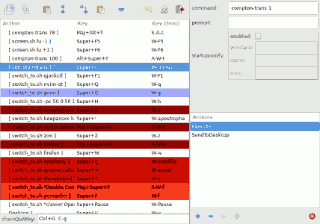

# obkey
ObKey - Openbox Key Editor (PyGObject version)




# Installation

# With Git
```shell
git clone https://github.com/luffah/obkey.git

# test it works (you can use it directly this way)
python obkey

# MANAGE DEPENDENCIES
# AND INSTALL

## With PIP and setup.py
sudo pip install gi gettext

sudo python setup.py install

## With Debian installer 
sudo apt install python-gi python-gettext
make deb

sudo dpkg -i deb_dist/obkey_1.2-1_all.deb
```

# Without Git

## Debian

Download the package here : [Obkey for debian](https://github.com/luffah/obkey/raw/master/deb_dist/obkey_1.2-1_all.deb)

```shell
sudo apt install python-gi python-gettext
sudo dpkg -i obkey_1.2-1_all.deb
```

# Usage
```shell
# Minimalist
obkey

# Custom file
obkey rc.xml

# With foreign languages
LANGUAGE=fr obkey

```

# Why ObKey ?
OpenBox is lightweight !

OpenBox is great !

OpenBox is one of the most customizable Window Manager in the World !

OpenBox allows to precisely place windows and to easily switch without clicking a mouse.

But, OpenBox configuration is written in XML..

Hey ! no need to navigate too much in XML, there's ObKey !


# Changes between obkey 1.1 and obkey 1.2 
- sorted actions in edition pane
- direct preview of relations between actions and keybind

TODO -> button to sort the keybind / drag and drop / alerting users on failure

# About KeyBindings
Key bindings in OpenBox official site :

http://openbox.org/wiki/Help:Bindings

If you want to edit shortcut directly in  command line interface,
see the next project (not updated since 2013...): https://sourceforge.net/projects/obhotkey/

The more serious alternative to obkey is probably lxhotkey : https://github.com/lxde/lxhotkey
